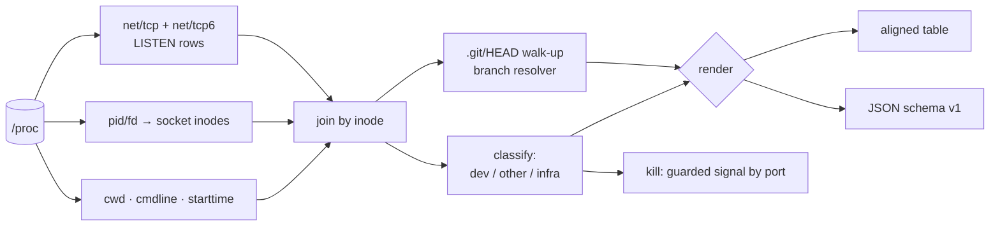

# devps

[English](README.md) | [中文](README.zh.md) | [日本語](README.ja.md)

[](LICENSE) [](go.mod) [](CHANGELOG.md)  [](CONTRIBUTING.md)

**devps：起動したまま忘れていた dev server を、ポート・プロジェクトディレクトリ・git ブランチ・経過時間つきで一覧するオープンソースのゼロ依存 CLI。リスニングソケットを背後のリポジトリまで結合する —— lsof や killport が裸の PID で止まるところを。**


```bash
git clone https://github.com/JaydenCJ/devps && cd devps
go build -o devps ./cmd/devps    # single static binary, stdlib only
```

> プレリリース：v0.1.0 はまだどのパッケージレジストリにも公開されていません。上記の手順でソースからビルドしてください（Go ≥1.22、Linux）。

## なぜ devps？

「Port 3000 already in use」は毎日の通過儀礼ですが、既存ツールは間違った問いに答えています。`lsof -i :3000` や `ss -ltnp` が教えてくれるのは pid とプロセス名 —— ありがたくも `node` —— だけ。本当に知りたいのは、その node が*どのプロジェクト*のものか、*どのブランチ*で起動したか、そして*どれだけ前に*忘れ去られたか、です。`killport` はさらに進んで pid を盲目的に撃ちますが、それは 5432 で動いていたのが postgres だったと気づくまでの話。本当の問いに答えるための情報は、実はすべてカーネルの中にあります：リスニングソケットには inode があり、inode はプロセスに対応し、プロセスには作業ディレクトリがあり、そのディレクトリの `.git/HEAD` にブランチ名が書かれています。devps はこの結合全体を 1 パスで実行し —— lsof も ss も、git すら実行せずに —— 結果を本当に見たいものへ絞り込みます：dev server とリポジトリ内で動くプロセスだけを表示し、sshd や docker-proxy のノイズは隠す。さらに `devps kill 5173` はポート指定でシグナルを送り、`--force` なしではインフラを拒否するガード付きです。

| | devps | lsof -i / ss -ltnp | killport | fuser -k |
|---|---|---|---|---|
| ポート → プロジェクトディレクトリの対応付け | ✅ | ❌ pid と名前のみ | ❌ | ❌ |
| ポートの背後の git ブランチを表示 | ✅ | ❌ | ❌ | ❌ |
| リスナーの経過時間を表示 | ✅ | ❌ | ❌ | ❌ |
| sshd/postgres/docker のノイズをデフォルトで非表示 | ✅ | ❌ | ❌ | ❌ |
| ポート指定 kill | ✅ ガード付き | ❌ pid を手で調べる | ✅ 盲目的 | ✅ 盲目的 |
| インフラの kill をデフォルトで拒否 | ✅ | 対象外 | ❌ | ❌ |
| 機械可読な JSON | ✅ | ⚠️ パース困難 | ❌ | ❌ |
| その行が表示された*理由*を説明できる（引用可能な argv ルール） | ✅ | ❌ | ❌ | ❌ |

<sub>動作確認は 2026-07-13、対象は lsof 4.95・iproute2 ss 6.1・killport 1.1：いずれもリスナーの作業ディレクトリ・ブランチ・経過時間を解決できません。</sub>

## 機能

- **pid ではなくプロジェクトを見る** —— `/proc/net/tcp{,6}` の inode を `/proc/<pid>/fd`、さらに `cwd` へ結合し、各ポートが `node (4102)` ではなく見覚えのあるディレクトリ名に着地します。
- **git を実行せずにブランチ取得** —— `.git/HEAD` を直接読む（worktree と `gitdir:` ポインタファイル対応）ので、`5173 → shop-frontend @ feature/checkout` は git 未インストールのマシンでも成立します。
- **経過時間がひと目で分かる** —— 起動時刻は `starttime` tick と起動時間から算出し、`45m`・`3h12m`・`2d4h` と表示。3 週間前のゾンビが即座に目に入ります。
- **ノイズよりシグナル** —— 厳選した分類器（vite、next、django runserver、rails、`go run` のビルドキャッシュバイナリ……）に「git リポジトリ内」ヒューリスティックを加え、消し忘れを表示し、sshd・postgres・docker-proxy は `--all` を指定しない限り隠します。
- **ガード付きのポート指定 kill** —— `devps kill 3000` は 3000 の dev server に SIGTERM を送り、インフラに対しては `--force` なしでは*拒否*します。`--dry-run` と `--signal` も完備。
- **見えない部分に正直** —— 他ユーザー所有のリスナー（root なしでは読めない）は正確にカウントして報告し、推測も黙殺も決してしません。
- **ゼロ依存・完全オフライン** —— Go 標準ライブラリのみ。devps は外部コマンドを一切実行せず、読むのは procfs と `.git` ファイルだけ。テレメトリなし、ネットワーク通信は一切なし。

## クイックスタート

```bash
./devps            # or: devps list
```

実際にキャプチャした出力：

```text
PORT  ADDR       PID   COMMAND                 PROJECT        BRANCH            AGE
3000  127.0.0.1  3987  next                    store-web      main              3h12m
5173  127.0.0.1  4102  vite                    shop-frontend  feature/checkout  2d
8000  *          5210  django runserver        billing-api    fix/api-timeout   1d2h
9090  127.0.0.1  6001  go run (metrics-relay)  metrics-relay  main              45m

2 other listeners hidden (rerun with --all to show)
```

2 日前の vite が居座っているポートを解放する（実際の出力）：

```text
$ devps kill 5173
sent SIGTERM to pid 4102 (vite, port 5173, shop-frontend @ feature/checkout)
```

安定した JSON でスクリプトを書く（`devps list --format json`、抜粋）：

```json
{
  "tool": "devps",
  "schema_version": 1,
  "listeners": [
    {
      "port": 5173,
      "addresses": [
        "127.0.0.1"
      ],
      "pid": 4102,
      "command": "vite",
      "kind": "dev",
      "project": "shop-frontend",
      "branch": "feature/checkout",
      "age_seconds": 172800,
      "age": "2d"
    }
  ],
  "hidden": 2
}
```

手元に server がなくても大丈夫。`bash examples/make-demo-proc.sh /tmp/devps-demo` が練習用の proc ツリーを偽造し、`--proc-root /tmp/devps-demo/proc` を付ければ上記のコマンドをすべて試せます。

## CLI リファレンス

`devps [list|kill|version] [flags] [port ...]` —— デフォルトのサブコマンドは `list`。終了コード：0 正常、1 該当なし / 拒否、2 使い方エラー、3 実行時エラー。

| フラグ | デフォルト | 効果 |
|---|---|---|
| `--format`（list） | `text` | `text` または `json` |
| `--all`（list） | オフ | インフラのデーモンを含む全リスナーを表示 |
| `--wide`（list） | オフ | フルパスのディレクトリに加え USER と ARGV 列 |
| `--no-git` | オフ | リポジトリ検索をスキップ |
| `--proc-root` | `/proc` | proc ファイルシステムのルート（偽造ツリー、コンテナのマウント） |
| `--signal`（kill） | `TERM` | `TERM`・`INT`・`HUP`・`QUIT`・`KILL`・`USR1/2` または番号 |
| `--force`（kill） | オフ | インフラや非プロジェクトのリスナーへのシグナル送信を許可 |
| `--dry-run`（kill） | オフ | 送信予定のシグナルを表示するだけで実際には送らない |

## 何が dev server と見なされるか

分類はルールベースで引用可能 —— 内部の仕組みは [docs/how-it-works.md](docs/how-it-works.md) を参照。

| シグナル | 例 | 表示 |
|---|---|---|
| argv に既知の dev ツール | `node …/.bin/vite`、`manage.py runserver` | `vite`、`django runserver` —— 常に表示 |
| `go run` のビルドキャッシュバイナリ | exe が `…/go-build…/exe/api` 配下 | `go run (api)` —— 常に表示 |
| スクリプトランナー | `npm run dev`、`pnpm dev` | `npm run dev` —— 常に表示 |
| git リポジトリ内の未知プロセス | cwd がリポジトリ内の `./myserver` | 名前付きでデフォルト表示 |
| リポジトリ外の未知プロセス | `/opt/mystery` | 非表示（カウントあり；`--all` で表示） |
| 既知のインフラ | sshd、postgres、docker-proxy、nginx…… | 非表示；`kill` は `--force` なしで拒否 |

v0.1.0 は Linux 専用：結合は Linux の proc ファイルシステムを直接読みます。IPv4 と IPv6（v4-mapped 含む）のリスナーに対応；UDP は未対応です。

## 検証

このリポジトリは CI を同梱しません。上記の主張はすべてローカル実行で検証されています：

```bash
go test ./...            # 90 deterministic tests, offline, no root, < 5 s
bash scripts/smoke.sh    # fabricated tree + a real listener on the live /proc, prints SMOKE OK
```

## アーキテクチャ



## ロードマップ

- [x] v0.1.0 —— socket→プロセス→プロジェクト→ブランチ結合、経過時間追跡、dev/infra 分類、ガード付きポート指定 `kill`、表/JSON 出力、`--proc-root`、90 テスト + smoke スクリプト
- [ ] macOS バックエンド（lsof ベース、表と JSON schema は共通）
- [ ] UDP リスナー（`--udp`）
- [ ] `devps watch` —— 新規・終了間際のリスナーをハイライトするライブ更新ビュー
- [ ] コンテナ認識：docker-proxy のポートを背後の compose プロジェクトへ対応付け
- [ ] シェルプロンプト用スニペット：消し忘れ server 数を PS1 に表示

完全なリストは [open issues](https://github.com/JaydenCJ/devps/issues) を参照してください。

## コントリビュート

issue・ディスカッション・pull request を歓迎します —— ローカルのワークフロー（フォーマット、vet、テスト、`SMOKE OK`）は [CONTRIBUTING.md](CONTRIBUTING.md) を参照。入門向けタスクは [good first issue](https://github.com/JaydenCJ/devps/issues?q=is%3Aissue+is%3Aopen+label%3A%22good+first+issue%22) のラベル付き、設計の議論は [Discussions](https://github.com/JaydenCJ/devps/discussions) で。

## ライセンス

[MIT](LICENSE)
