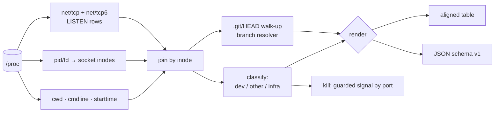

# devps

[English](README.md) | [中文](README.zh.md) | [日本語](README.ja.md)

[](LICENSE) [](go.mod) [](CHANGELOG.md)  [](CONTRIBUTING.md)

**devps：an open-source, zero-dependency CLI that lists every dev server you left running — port, project directory, git branch, age — by joining listening sockets to the repositories behind them, where lsof and killport stop at bare PIDs.**


```bash
git clone https://github.com/JaydenCJ/devps && cd devps
go build -o devps ./cmd/devps    # single static binary, stdlib only
```

> Pre-release: v0.1.0 is not tagged on a package registry yet; build from source as above (any Go ≥1.22, Linux).

## Why devps?

"Port 3000 already in use" is a daily rite, and the existing tooling answers the wrong question. `lsof -i :3000` and `ss -ltnp` tell you a pid and a process name — `node`, helpfully — when what you actually want to know is *which project* that node belongs to, *which branch* it was started on, and *how long ago* you forgot about it. `killport` goes one step further and just shoots the pid blind, which works right up until the thing on 5432 was postgres. The information needed to answer the real question is already in the kernel: every listening socket has an inode, every inode maps to a process, every process has a working directory, and that directory's `.git/HEAD` names the branch. devps performs that whole join in one pass — no lsof, no ss, not even git is executed — then filters the result to what you actually meant: dev servers and anything running inside a repository, with sshd and docker-proxy noise hidden. And `devps kill 5173` signals by port with a guard that refuses infrastructure unless you `--force` it.

| | devps | lsof -i / ss -ltnp | killport | fuser -k |
|---|---|---|---|---|
| Maps port → project directory | ✅ | ❌ pid + name only | ❌ | ❌ |
| Shows the git branch behind a port | ✅ | ❌ | ❌ | ❌ |
| Shows listener age | ✅ | ❌ | ❌ | ❌ |
| Hides sshd/postgres/docker noise by default | ✅ | ❌ | ❌ | ❌ |
| Kill by port | ✅ guarded | ❌ manual pid | ✅ blind | ✅ blind |
| Refuses to kill infrastructure by default | ✅ | n/a | ❌ | ❌ |
| Machine-readable JSON | ✅ | ⚠️ parse-hostile | ❌ | ❌ |
| Explains *why* a row is shown (quotable argv rule) | ✅ | ❌ | ❌ | ❌ |

<sub>Behavior checked 2026-07-13 against lsof 4.95, iproute2 ss 6.1, killport 1.1: none of the three resolves working directories, branches, or process age for listeners.</sub>

## Features

- **Project-aware, not pid-aware** — joins `/proc/net/tcp{,6}` inodes to `/proc/<pid>/fd`, then to `cwd`, so every port lands on a directory name you recognize instead of `node (4102)`.
- **Branch without running git** — reads `.git/HEAD` directly (worktrees and `gitdir:` pointer files included), so `5173 → shop-frontend @ feature/checkout` works even on machines without git installed.
- **Age at a glance** — start times come from `starttime` ticks plus boot time, rendered as `45m`, `3h12m`, `2d4h`; the three-week-old zombie stands out immediately.
- **Signal over noise** — a curated classifier (vite, next, django runserver, rails, `go run` build-cache binaries, …) plus an "in a git repo" heuristic shows what you left running and hides sshd, postgres, and docker-proxy unless you ask with `--all`.
- **Guarded kill by port** — `devps kill 3000` sends SIGTERM to the dev server on 3000 and *refuses* infrastructure without `--force`; `--dry-run` and `--signal` included.
- **Honest about blind spots** — listeners owned by other users (unreadable without root) are counted and reported, never guessed at or silently dropped.
- **Zero dependencies, fully offline** — Go standard library only; devps executes no external commands and reads nothing but procfs and `.git` files. No telemetry, no network, ever.

## Quickstart

```bash
./devps            # or: devps list
```

Real captured output:

```text
PORT  ADDR       PID   COMMAND                 PROJECT        BRANCH            AGE
3000  127.0.0.1  3987  next                    store-web      main              3h12m
5173  127.0.0.1  4102  vite                    shop-frontend  feature/checkout  2d
8000  *          5210  django runserver        billing-api    fix/api-timeout   1d2h
9090  127.0.0.1  6001  go run (metrics-relay)  metrics-relay  main              45m

2 other listeners hidden (rerun with --all to show)
```

Free the port that vite from two days ago is squatting on (real output):

```text
$ devps kill 5173
sent SIGTERM to pid 4102 (vite, port 5173, shop-frontend @ feature/checkout)
```

Script against it with stable JSON (`devps list --format json`, excerpt):

```json
{
  "tool": "devps",
  "schema_version": 1,
  "listeners": [
    {
      "port": 5173,
      "addresses": [
        "127.0.0.1"
      ],
      "pid": 4102,
      "command": "vite",
      "kind": "dev",
      "project": "shop-frontend",
      "branch": "feature/checkout",
      "age_seconds": 172800,
      "age": "2d"
    }
  ],
  "hidden": 2
}
```

No servers to hand? `bash examples/make-demo-proc.sh /tmp/devps-demo` fabricates a playground proc tree and `--proc-root /tmp/devps-demo/proc` runs every command above against it.

## CLI reference

`devps [list|kill|version] [flags] [port ...]` — `list` is the default. Exit codes: 0 ok, 1 no match / refused, 2 usage error, 3 runtime error.

| Flag | Default | Effect |
|---|---|---|
| `--format` (list) | `text` | `text` or `json` |
| `--all` (list) | off | show every listener, including infrastructure daemons |
| `--wide` (list) | off | full directories plus USER and ARGV columns |
| `--no-git` | off | skip repository lookup |
| `--proc-root` | `/proc` | proc filesystem root (fabricated trees, container mounts) |
| `--signal` (kill) | `TERM` | `TERM`, `INT`, `HUP`, `QUIT`, `KILL`, `USR1/2`, or a number |
| `--force` (kill) | off | allow signalling infra and non-project listeners |
| `--dry-run` (kill) | off | print what would be signalled without sending anything |

## What counts as a dev server

Classification is rule-based and quotable — internals in [docs/how-it-works.md](docs/how-it-works.md).

| Signal | Example | Shown as |
|---|---|---|
| Known dev tool in argv | `node …/.bin/vite`, `manage.py runserver` | `vite`, `django runserver` — always shown |
| `go run` build-cache binary | exe under `…/go-build…/exe/api` | `go run (api)` — always shown |
| Script runner | `npm run dev`, `pnpm dev` | `npm run dev` — always shown |
| Unknown process inside a git repo | `./myserver` with cwd in a repo | named, shown by default |
| Unknown process outside any repo | `/opt/mystery` | hidden (counted; `--all` shows) |
| Known infrastructure | sshd, postgres, docker-proxy, nginx, … | hidden; `kill` refuses without `--force` |

Linux-only in v0.1.0: the join reads the Linux proc filesystem directly. IPv4 and IPv6 (including v4-mapped) listeners are supported; UDP is not yet.

## Verification

This repository ships no CI; every claim above is verified by local runs:

```bash
go test ./...            # 90 deterministic tests, offline, no root, < 5 s
bash scripts/smoke.sh    # fabricated tree + a real listener on the live /proc, prints SMOKE OK
```

## Architecture



## Roadmap

- [x] v0.1.0 — socket→process→project→branch join, age tracking, dev/infra classification, guarded `kill` by port, table/JSON output, `--proc-root`, 90 tests + smoke script
- [ ] macOS backend (lsof-based, same table and JSON schema)
- [ ] UDP listeners (`--udp`)
- [ ] `devps watch` — live-updating view that highlights new and dying listeners
- [ ] Container awareness: map docker-proxy ports back to the compose project behind them
- [ ] Shell-prompt snippet: forgotten-server count in your PS1

See the [open issues](https://github.com/JaydenCJ/devps/issues) for the full list.

## Contributing

Issues, discussions and pull requests are welcome — see [CONTRIBUTING.md](CONTRIBUTING.md) for the local workflow (format, vet, tests, `SMOKE OK`). Good entry points are labelled [good first issue](https://github.com/JaydenCJ/devps/issues?q=is%3Aissue+is%3Aopen+label%3A%22good+first+issue%22), and design questions live in [Discussions](https://github.com/JaydenCJ/devps/discussions).

## License

[MIT](LICENSE)
