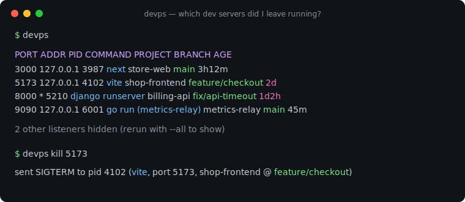
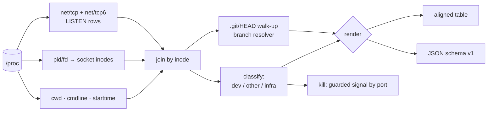

# devps

[English](README.md) | [中文](README.zh.md) | [日本語](README.ja.md)

[](LICENSE) [](go.mod) [](CHANGELOG.md)  [](CONTRIBUTING.md)

**devps：一个开源、零依赖的 CLI，列出你忘记关掉的每一个 dev server —— 端口、项目目录、git 分支、运行时长 —— 把监听 socket 和背后的仓库直接关联起来；而 lsof 和 killport 只能给你一个光秃秃的 PID。**



```bash
git clone https://github.com/JaydenCJ/devps && cd devps
go build -o devps ./cmd/devps    # single static binary, stdlib only
```

> 预发布：v0.1.0 尚未发布到任何包仓库；请按上面方式从源码构建（任意 Go ≥1.22，Linux）。

## 为什么选 devps？

"Port 3000 already in use" 是每天都要经历的仪式，而现有工具回答的是错误的问题。`lsof -i :3000` 和 `ss -ltnp` 告诉你一个 pid 和进程名 —— 一个毫无信息量的 `node` —— 但你真正想知道的是那个 node 属于*哪个项目*、启动时在*哪个分支*、以及你把它遗忘了*多久*。`killport` 更进一步，直接对 pid 盲开一枪，这在 5432 上跑的是 postgres 之前都挺好用。回答真正问题所需的信息其实早已在内核里：每个监听 socket 有一个 inode，每个 inode 对应一个进程，每个进程有工作目录，而该目录的 `.git/HEAD` 写着分支名。devps 一次扫描完成整条 join —— 不调 lsof、不调 ss、连 git 都不执行 —— 然后把结果过滤成你真正关心的：dev server 和任何跑在仓库里的进程，sshd 和 docker-proxy 之类的噪音默认隐藏。而 `devps kill 5173` 按端口发信号，并带有守护：不加 `--force` 就拒绝对基础设施下手。

| | devps | lsof -i / ss -ltnp | killport | fuser -k |
|---|---|---|---|---|
| 端口 → 项目目录的映射 | ✅ | ❌ 只有 pid + 进程名 | ❌ | ❌ |
| 显示端口背后的 git 分支 | ✅ | ❌ | ❌ | ❌ |
| 显示监听进程的运行时长 | ✅ | ❌ | ❌ | ❌ |
| 默认隐藏 sshd/postgres/docker 噪音 | ✅ | ❌ | ❌ | ❌ |
| 按端口 kill | ✅ 带守护 | ❌ 手动查 pid | ✅ 盲杀 | ✅ 盲杀 |
| 默认拒绝杀基础设施进程 | ✅ | 不适用 | ❌ | ❌ |
| 机器可读的 JSON | ✅ | ⚠️ 难以解析 | ❌ | ❌ |
| 能解释*为什么*显示这一行（可引用的 argv 规则） | ✅ | ❌ | ❌ | ❌ |

<sub>行为核对于 2026-07-13，对象为 lsof 4.95、iproute2 ss 6.1、killport 1.1：三者均无法为监听进程解析工作目录、分支或运行时长。</sub>

## 功能特性

- **认项目，不认 pid** —— 把 `/proc/net/tcp{,6}` 的 inode join 到 `/proc/<pid>/fd`，再到 `cwd`，每个端口最终落在你认识的目录名上，而不是 `node (4102)`。
- **不跑 git 也能拿到分支** —— 直接读 `.git/HEAD`（含 worktree 和 `gitdir:` 指针文件），`5173 → shop-frontend @ feature/checkout` 在没装 git 的机器上照样成立。
- **一眼看出跑了多久** —— 启动时间由 `starttime` tick 加开机时间算出，渲染成 `45m`、`3h12m`、`2d4h`；三周前的僵尸进程一眼就能认出来。
- **信号大于噪音** —— 精选的分类器（vite、next、django runserver、rails、`go run` 构建缓存二进制……）加上"在 git 仓库里"启发式，显示你忘关的东西，隐藏 sshd、postgres 和 docker-proxy，除非你用 `--all` 明确要求。
- **带守护的按端口 kill** —— `devps kill 3000` 向 3000 上的 dev server 发 SIGTERM，对基础设施则*拒绝*执行，除非 `--force`；`--dry-run` 和 `--signal` 一应俱全。
- **对盲区诚实** —— 其他用户拥有的监听进程（无 root 读不到）会被如实计数并报告，绝不瞎猜、也绝不悄悄丢弃。
- **零依赖、完全离线** —— 只用 Go 标准库；devps 不执行任何外部命令，只读 procfs 和 `.git` 文件。没有遥测，永不联网。

## 快速上手

```bash
./devps            # or: devps list
```

真实捕获的输出：

```text
PORT  ADDR       PID   COMMAND                 PROJECT        BRANCH            AGE
3000  127.0.0.1  3987  next                    store-web      main              3h12m
5173  127.0.0.1  4102  vite                    shop-frontend  feature/checkout  2d
8000  *          5210  django runserver        billing-api    fix/api-timeout   1d2h
9090  127.0.0.1  6001  go run (metrics-relay)  metrics-relay  main              45m

2 other listeners hidden (rerun with --all to show)
```

把两天前那个 vite 占着的端口腾出来（真实输出）：

```text
$ devps kill 5173
sent SIGTERM to pid 4102 (vite, port 5173, shop-frontend @ feature/checkout)
```

用稳定的 JSON 写脚本（`devps list --format json`，节选）：

```json
{
  "tool": "devps",
  "schema_version": 1,
  "listeners": [
    {
      "port": 5173,
      "addresses": [
        "127.0.0.1"
      ],
      "pid": 4102,
      "command": "vite",
      "kind": "dev",
      "project": "shop-frontend",
      "branch": "feature/checkout",
      "age_seconds": 172800,
      "age": "2d"
    }
  ],
  "hidden": 2
}
```

手边没有现成的 server？`bash examples/make-demo-proc.sh /tmp/devps-demo` 会伪造一棵练手用的 proc 树，配合 `--proc-root /tmp/devps-demo/proc` 就能对着它跑上面的每一条命令。

## CLI 参考

`devps [list|kill|version] [flags] [port ...]` —— 默认子命令是 `list`。退出码：0 正常，1 无匹配 / 被拒绝，2 用法错误，3 运行时错误。

| 标志 | 默认值 | 效果 |
|---|---|---|
| `--format`（list） | `text` | `text` 或 `json` |
| `--all`（list） | 关 | 显示所有监听进程，包括基础设施守护进程 |
| `--wide`（list） | 关 | 完整目录，外加 USER 和 ARGV 列 |
| `--no-git` | 关 | 跳过仓库查找 |
| `--proc-root` | `/proc` | proc 文件系统根（伪造树、容器挂载） |
| `--signal`（kill） | `TERM` | `TERM`、`INT`、`HUP`、`QUIT`、`KILL`、`USR1/2` 或数字 |
| `--force`（kill） | 关 | 允许向基础设施和非项目监听进程发信号 |
| `--dry-run`（kill） | 关 | 只打印将要发送的信号，不实际发送 |

## 什么算 dev server

分类基于规则、可引用 —— 内部机制见 [docs/how-it-works.md](docs/how-it-works.md)。

| 信号 | 示例 | 显示为 |
|---|---|---|
| argv 中出现已知 dev 工具 | `node …/.bin/vite`、`manage.py runserver` | `vite`、`django runserver` —— 始终显示 |
| `go run` 构建缓存二进制 | exe 位于 `…/go-build…/exe/api` | `go run (api)` —— 始终显示 |
| 脚本运行器 | `npm run dev`、`pnpm dev` | `npm run dev` —— 始终显示 |
| git 仓库内的未知进程 | cwd 在仓库里的 `./myserver` | 具名显示，默认可见 |
| 仓库外的未知进程 | `/opt/mystery` | 隐藏（计数；`--all` 可见） |
| 已知基础设施 | sshd、postgres、docker-proxy、nginx…… | 隐藏；`kill` 不加 `--force` 即拒绝 |

v0.1.0 仅支持 Linux：join 直接读取 Linux proc 文件系统。支持 IPv4 和 IPv6（含 v4-mapped）监听；UDP 暂不支持。

## 验证

本仓库不附带 CI；上面的每一条断言都由本地运行验证：

```bash
go test ./...            # 90 deterministic tests, offline, no root, < 5 s
bash scripts/smoke.sh    # fabricated tree + a real listener on the live /proc, prints SMOKE OK
```

## 架构



## 路线图

- [x] v0.1.0 —— socket→进程→项目→分支 join、时长追踪、dev/infra 分类、带守护的按端口 `kill`、表格/JSON 输出、`--proc-root`、90 个测试 + smoke 脚本
- [ ] macOS 后端（基于 lsof，表格与 JSON schema 保持一致）
- [ ] UDP 监听（`--udp`）
- [ ] `devps watch` —— 实时刷新视图，高亮新出现和正在退出的监听进程
- [ ] 容器感知：把 docker-proxy 端口映射回背后的 compose 项目
- [ ] shell 提示符片段：在 PS1 里显示被遗忘的 server 数量

完整列表见 [open issues](https://github.com/JaydenCJ/devps/issues)。

## 参与贡献

欢迎 issue、讨论和 pull request —— 本地工作流（格式化、vet、测试、`SMOKE OK`）见 [CONTRIBUTING.md](CONTRIBUTING.md)。入门任务标记为 [good first issue](https://github.com/JaydenCJ/devps/issues?q=is%3Aissue+is%3Aopen+label%3A%22good+first+issue%22)，设计讨论在 [Discussions](https://github.com/JaydenCJ/devps/discussions)。

## 许可证

[MIT](LICENSE)
